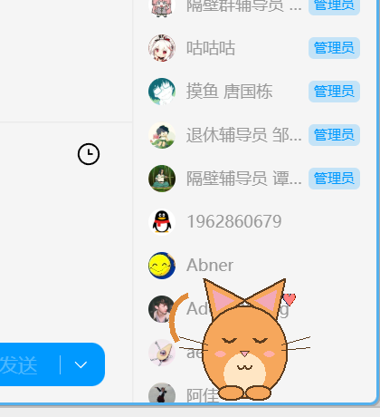

# 🐾 Habit Pet —— 现实数据喂养的桌面宠物

> 对应《项目前景报告 05》。M1-M3（数据闭环 MVP）、v0.2（养成与留存）、v0.3（专注模式 + 分享卡）已完成。
> 一只养在桌面上的橘猫：**饱食度由你的 git commit 喂养、久坐掉血、熬夜掉寿命上限**，
> LLM 负责针对你的行为说风凉话。



## 它是怎么活的

| 数值 | 驱动方式 | 死穴 |
|---|---|---|
| 饱食度 | 每个新 commit +14，随时间自然衰减（4/小时） | 0 也不会死，但会饿得说你 |
| 心情 | commit / 撸猫 / 投喂 / 完成专注提升，缓慢衰减 | 低了会摆烂脸 |
| 健康度 | 连续伏案 45 分钟 -8；起身活动 10 分钟 +5；**专注期间豁免** | **归零 → 离家出走 3 天**（不判死亡） |
| 寿命上限 | 凌晨 0-6 点仍活跃，每小时 -3（下限 30） | 不可逆，是熬夜的真实代价 |

数据源只有两个，均**本地处理**：

- **git**：对你配置的仓库跑 `git rev-list --since`，只读提交哈希，不看任何文件内容；
- **键鼠空闲**：Windows `GetLastInputInfo`，只回答"最近 60 秒有没有动"，零隐私风险。

## 养成系统（v0.2，对应报告"留存是最大风险"）

- **成长阶段**：成长值 = commit 数 + 活跃天数×5，**幼猫 → 成猫 → 大猫**只升不降，
  体型随阶段变大。弃养 = 养成记录清零，这是留存机制的核心。
- **连续活跃 streak**：每天有 commit 或伏案 ≥30 分钟记为活跃天；隔天没开程序直接断签
  （连 3 天以上断签会被哀怨），最高纪录永久保留。
- **成就（17 枚）**：开饭初心 / 青铜→王者铲屎官 / 周全勤 / 破镜重圆 / 夜猫子认证 /
  早鸟 / 劳逸结合 / 身心健康 / 百日夜 / 第一颗番茄→番茄大亨……解锁即弹气泡庆祝，
  右键"我的成就"随时查看。
- **气泡排队**：事件消息逐条展示，不再互相顶掉。

## 专注模式（v0.3）

右键 → **开始专注 25 分钟**：猫趴在旁边盯着你，头顶显示倒计时。

- 专注期间的连续伏案**不算久坐**（正事不是病），健康不掉血；
- 计时只累计"在座"时间：离开键盘超过 10 分钟自动**暂停**（猫会喊你），回来自动继续；
- 完成一颗番茄：心情 +10，计入日报/周报的"番茄"统计，凑够次数解锁番茄系成就；
- 随时可以从菜单取消（猫假装没看见）。

## 周报分享卡（v0.3）

右键 → **生成分享卡**：把本周数据（阶段 / streak / commit / 番茄 / 久坐 / 熬夜 / 成就）
渲染成一张带猫咪插画的 PNG，自动用看图软件打开，直接发群/发圈。
依赖可选的 Pillow（`pip install pillow`），没装也不影响其他功能。

## 快速开始

```bash
cd habit-pet
pip install -r requirements.txt   # requests 用于 LLM 吐槽；分享卡另需可选的 pillow
python -m habitpet                # 或直接双击 run.bat
```

首次运行会在 `~/.habitpet/` 生成 `config.json`，把你的仓库路径填进 `repos`：

```json
{ "repos": ["E:\\your\\project", "C:\\code\\another-one"] }
```

改完配置重启（右键猫 → 退出）即可生效。右键菜单里可以打开**开机自启**
（写 HKCU Run 键，无需管理员权限，可随时关闭）。

### LLM 每日吐槽（可选）

- 支持 GLM Flash：配置 `"llm": {"api_key": "..."}` 或设置环境变量 `GLM_API_KEY`
- **没有 key 也能玩**：全部台词都有离线模板兜底，宠物永远不会哑巴
- 每天 21:30 自动生成一句吐槽 + 日报（`~/.habitpet/reports/daily-*.md`）

### 交互

- **左键点击**：撸猫（心情 +2）
- **左键拖拽**：挪窝（位置会记住）
- **右键菜单**：状态 / 我的成就 / 专注 / 喂粮 / 吐槽 / 周报 / 分享卡 /
  数据文件夹 / 开机自启 / 退出

## 项目结构

```
habit-pet/
├── habitpet/
│   ├── state.py          # 状态机：数值、事件、离家出走、专注会话、存档
│   ├── growth.py         # 养成系统：成长阶段 / streak / 成就
│   ├── focus.py          # 专注会话（番茄钟计时）
│   ├── share_card.py     # 周报分享卡（PIL 渲染，可选依赖）
│   ├── bubble_queue.py   # 事件气泡排队
│   ├── autostart.py      # 开机自启（winreg，键路径可注入便于测试）
│   ├── theme.py          # 猫配色共享（tk 渲染与 PIL 分享卡一致）
│   ├── collectors/
│   │   ├── gitfeed.py    # git 提交轮询（rev-list --count，空仓库不误判）
│   │   ├── idle.py       # GetLastInputInfo 键鼠空闲
│   │   └── clock.py      # 熬夜时段判定
│   ├── narrator.py       # 台词系统：GLM Flash + 模板兜底
│   ├── report.py         # 日报 / 周报（Markdown）
│   ├── pet_window.py     # tkinter 透明置顶窗 + 程序化绘制（支持阶段缩放）
│   └── app.py            # 主循环接线（工作线程经队列回传 UI，不动 Tk 线程禁忌）
├── launch.pyw            # 无控制台启动入口（开机自启用）
├── tests/                # 68 个单元测试
├── config.example.json
└── run.bat
```

## 测试与冒烟

```bash
python -m unittest discover -s tests -t .   # 68 tests OK
python -m habitpet --smoke                   # 启动 4 秒自动退出，打印状态
```

## 设计取舍（对照前景报告）

- **未走 DyberPet 插件路线**：报告建议"借 DyberPet 壳"省动画层，但为了让数据闭环
  可独立验证，MVP 直接用 tkinter 程序化画猫（零美术资产、零版权链问题）。
  状态机与 UI 已分离，后续要接 DyberPet 只需写适配器。
- **心情**未按报告接"屏幕娱乐时间"（需要读浏览器历史，隐私成本高），改为由
  互动和产出驱动，MVP 阶段够用。
- **防作弊**：报告已回答——用户自己刷 commit 喂宠物本来就是自我欺骗工具，
  不做对抗性设计。
- **留存设计**（v0.2）：按报告"把宠物养成挂在用户真实成长上"的思路落地为
  成长阶段 + streak + 成就三件套，全部挂在真实行为数据上。
- **专注豁免久坐**（v0.3）：久坐惩罚针对"无意识瘫着"，番茄钟是刻意工作，
  惩罚它会惩罚错人；用奖励（心情 +10）代替惩罚。

## 路线图

- [x] M1：git 提交喂食 + 久坐掉血
- [x] M2：熬夜判定 + 状态机调平（离家出走机制）
- [x] M3：LLM 每日吐槽 + 日报/周报
- [x] v0.2：养成与留存系统（成长阶段 / streak / 成就 / 开机自启 / 气泡排队）
- [x] v0.3：专注模式（番茄钟）+ 周报分享卡
- [ ] M4：独立美术壳 / 多数据源 / 直播弹幕联动（接 02 号弹幕引擎）/ 多宠物牧场

## 隐私红线

所有行为数据本地处理（`~/.habitpet/`），不上传、不截屏；LLM 仅在开启吐槽时
收到**当日聚合数字**（commit 数、小时数），收不到任何代码内容。
