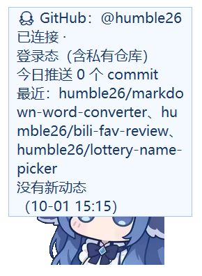

# 🐋 Habit Pet · 鲸鱼娘版 —— 现实数据喂养的桌面宠物

> 对应《项目前景报告 05》。M1-M3（数据闭环 MVP）、v0.2（养成与留存）、v0.3（专注模式 + 分享卡）已完成；
> **v0.4 起形象从程序化绘制的橘猫升级为鲸鱼娘**，并融合了 DSH「小鲸鱼」挂件的玩法
> （按压 Q 弹与音效、rua 动图、拖拽吸附镜像、DeepSeek 余额 / 今日已用 / 预警）。
> **v0.5 起并入四家 AI 客户端的剩余积分查询**（Trae CN / TraeWork CN / WorkBuddy / Qoder CN）。
> **v0.6 起可连接 GitHub**：别的机器上的推送也会顺着洋流喂到她嘴里（远程投喂），
> 并带来动态展示与云端成就。
> 一只养在桌面上的鲸鱼娘：**饱食度由你的 git commit 喂养、久坐掉血、熬夜掉寿命上限**，
> LLM 负责针对你的行为说风凉话。


## 它是怎么活的

| 数值 | 驱动方式 | 死穴 |
|---|---|---|
| 饱食度 | 每个新 commit +14，随时间自然衰减（4/小时） | 0 也不会死，但会饿得说你 |
| 心情 | commit / 摸摸头 / 投喂 / 完成专注提升，缓慢衰减 | 低了会摆烂脸 |
| 健康度 | 连续伏案 45 分钟 -8；起身活动 10 分钟 +5；**专注期间豁免** | **归零 → 出海散心 3 天**（不判死亡） |
| 寿命上限 | 凌晨 0-6 点仍活跃，每小时 -3（下限 30） | 不可逆，是熬夜的真实代价 |

数据源默认全部**本地处理**：

- **git**：对你配置的仓库跑 `git rev-list --since`，只读提交哈希，不看任何文件内容；
- **键鼠空闲**：Windows `GetLastInputInfo`，只回答"最近 60 秒有没有动"，零隐私风险。

v0.6 起多了一个**可整体关闭的云端数据源**——GitHub（见「GitHub 云端连接」一节）：
只读你自己的推送事件，请求只发往 api.github.com。

## 融合玩法（并入 DSH 小鲸鱼挂件的体验，v0.4）

- **按压 Q 弹**：按住鲸鱼娘会像玩偶一样压扁，松手回弹；
- **音效**：按压 / 松开各有音色（内置「小黄鸭」「音效1」两套），
  专注完成 / 进化时播 Minecraft·经验球音；右键菜单可切换或关闭；
- **摸摸头动图**：连续点她两下会播 rua 动图（有彩蛋感）；
- **拖拽吸附 + 镜像**：甩到屏幕边缘松手会贴边停住，贴左边缘时整体水平镜像
  （面向屏幕中央，和挂件同款行为）；可在菜单里关掉；
- **小鲸鱼记账**：DeepSeek 余额直查 + 今日已用 + 低余额预警，见下节；
- **自定义角色**：`config.json` 的 `pet_image` 指到任意本地 PNG 即可换形象，
  删除/失效自动回退内置鲸鱼娘。

## 小鲸鱼记账（v0.4，独立于 DSH 挂件）

右键菜单 → **余额 · ¥xx（点我刷新）**：

- **余额**：直查 DeepSeek 官方余额接口（`/user/balance`），后台线程轮询（默认 300 秒）+ 手动刷新；
- **今日已用**：按**余额差观测**——当天余额的下降累计为消费；充值/赠金单独记录、不冲抵已有消费
  （与 DSH 挂件的记账口径一致），账本存 `~/.habitpet/balance.json`；
- **低余额预警**：`balance.low_alert` 设成正数后，余额低于它当天弹一次提醒；
- **key 解析顺序**（任一可用即可，配置文件里不会写出 key 本身）：
  1. `config.json` → `balance.api_key`
  2. 环境变量 `DEEPSEEK_API_KEY`
  3. DSH 凭据 `~/.dsh/.credentials.yaml`（**只读**自动读取）
- **零依赖挂件**：挂件跑不跑都能用；查询失败静默降级为"暂无数据"，绝不影响桌宠主循环。

## 剩余积分（Trae CN / TraeWork CN / WorkBuddy / Qoder CN，v0.5）

右键菜单 → **剩余积分 ▸**，四家客户端各一行；点任意一行（或"全部刷新"）
重新查询并更新气泡。默认每 30 分钟自动轮询（`credits.poll_seconds`）。

各客户端本机的登录态是**全自动读取**的（只读、只在内存里用于当次请求，
不写日志、不落盘）：

| 客户端 | 读取来源 | 查询接口 | 显示什么 |
|---|---|---|---|
| Trae CN | `%APPDATA%\Trae CN\...\storage.json` 的自加密凭据（本地解密） | api.trae.cn 额度 + 签到接口 | 剩余 / 已用 / 今日签到 |
| TraeWork CN | 同上（TRAE SOLO CN 客户端） | 同上 | 同上 |
| WorkBuddy | 客户端日志的最近签到记录 + `workbuddy.db` 本地台账 | 服务端接口需登录态，暂不可得 | 今日已签 / 连续天数 / 本机今日消耗 |
| Qoder CN | Electron OSCrypt 存储（DPAPI + AES 本地解密） | openapi.qoder.com.cn `/sash/api/v1/me/*` 候选端点 | 已登录（额度端点识别中） |

已知边界（说在前面，防止期待落空）：

- **Trae 系**读的是客户端最后一次写盘的登录态；太久没打开客户端会提示
  "登录态已过期：打开一次客户端刷新"，打开一次即恢复。
- **WorkBuddy** 服务端接口带登录态校验且本地读不到该凭据，因此展示**本地台账**
  （签到状态 + 本机今日消耗）。想接服务端实时状态可把凭据填进
  `credits.workbuddy_token`（实验性）。
- **Qoder CN** 的登录凭据能自动解密、服务端也认可（会显示账号与有效期），
  但其"额度"接口路径截至客户端 0.4.3 尚未识别；程序会用候选表持续探测，
  命中后自动缓存复用（自愈），在此之前显示"已登录 · 额度接口未识别"。
- 单独关某家：`credits.providers.<key>.enabled = false`；整体关闭：
  `credits.enabled = false`。查询都在后台线程，任何一家失败只降级为一行提示，
  绝不影响桌宠主循环。

命令行排查（跑一次打印四家结果，不写任何文件）：

```bash
python -m habitpet.credits            # 四家各查一次
python -m habitpet.credits qoder_cn   # 只查其中一家
```

## GitHub 云端连接（v0.6）

右键菜单 → **连接 GitHub 账号**（已连接后变成 **GitHub @你 · 点我刷新**）。
只做一件事：读你自己 GitHub 账号的**推送事件**。三样收益：

- **远程投喂**：在别的机器上、没克隆到本地的仓库里推送的 commit，也会喂给鲸鱼娘。
  - 本地已配置的仓库按 `origin` 归一化后**排重**：同一个 push 不会被本地扫描和云端事件喂两遍；
  - 首次连接只回溯 **24 小时内**的远程推送（上限 40 个 commit），不会翻旧账把你撑死；
  - 想只看不喂？`github.feed = false`。
- **动态展示**：状态气泡与右键菜单里显示 @用户名、今日推送数、最近推送的仓库；
  周报和分享卡多一行「GitHub 云端投喂」。
- **专属成就（5 枚）**：接入云端 / 深海快递 / 云端饲养员 / 七海巡游 / 八爪鱼（来自 5 个不同仓库）。



登录态**全自动复用本机**，按以下顺序解析，任一可用即可：

1. `config.json` → `github.token`（一般不用填）；
2. **本机 gh CLI**（你 `gh auth login` 过的账号，`gh auth token` 只读取出，token 只在内存里用于请求）；
3. 匿名公开数据（只有公开推送，接口限额 60 次/时）。

用户名解析顺序：`github.username` → 凭据对应的账号（`/user`）→ `git config github.user`。
网络失败 / 没装 gh / 未登录全部**静默降级为一行提示**，绝不影响桌宠主循环；
`github.enabled = false` 可整段关闭。

命令行排查（跑一次打印连接结果，不写任何文件）：

```bash
python -m habitpet.collectors.github            # 自动解析登录态并抓一次事件
python -m habitpet.collectors.github humble26   # 指定用户名（匿名模式）
```

## 养成系统（v0.2，对应报告"留存是最大风险"）

- **成长阶段**：成长值 = commit 数 + 活跃天数×5，**幼鲸 → 鲸鱼娘 → 深海鲸鱼娘**只升不降，
  体型随阶段变大。弃养 = 养成记录清零，这是留存机制的核心。
- **连续活跃 streak**：每天有 commit 或伏案 ≥30 分钟记为活跃天；隔天没开程序直接断签
  （连 3 天以上断签会被哀怨），最高纪录永久保留。
- **成就（22 枚）**：初见鲸喜 / 青铜→王者饲养员 / 周全勤 / 破镜重圆 / 夜航鲸认证 /
  早鸟 / 劳逸结合 / 身心健康 / 百日夜 / 第一颗番茄→番茄大亨 / 接入云端 /
  深海快递 / 云端饲养员 / 七海巡游 / 八爪鱼……解锁即弹气泡庆祝，
  右键"我的成就"随时查看。
- **气泡排队**：事件消息逐条展示，不再互相顶掉。
- 老存档（v0.3 橘猫版）无缝升级：成就 ID 与阶段索引不变，只是展示名换了鲸鱼娘口径。

## 专注模式（v0.3）

右键 → **开始专注 25 分钟**：鲸鱼娘守在旁边盯着你，头顶显示倒计时。

- 专注期间的连续伏案**不算久坐**（正事不是病），健康不掉血；
- 计时只累计"在座"时间：离开键盘超过 10 分钟自动**暂停**（她会喊你），回来自动继续；
- 完成一颗番茄：心情 +10、播经验球音效，计入日报/周报的"番茄"统计，凑够次数解锁番茄系成就；
- 随时可以从菜单取消（她假装没看见）。

## 周报分享卡（v0.3，v0.4 换鲸鱼娘插画）

右键 → **生成分享卡**：把本周数据（阶段 / streak / commit / 番茄 / 久坐 / 熬夜 / 成就）
渲染成一张带鲸鱼娘插画的 PNG，自动用看图软件打开，直接发群/发圈。
依赖可选的 Pillow（`pip install pillow`），没装也不影响其他功能。

## 快速开始

```bash
cd habit-pet
pip install -r requirements.txt   # requests 用于 LLM 吐槽；分享卡另需可选的 pillow
python -m habitpet                # 或直接双击 run.bat
```

首次运行会在 `~/.habitpet/` 生成 `config.json`，把你的仓库路径填进 `repos`：

```json
{ "repos": ["E:\\your\\project", "C:\\code\\another-one"] }
```

改完配置重启（右键鲸鱼娘 → 退出）即可生效。右键菜单里可以打开**开机自启**
（写 HKCU Run 键，无需管理员权限，可随时关闭）。

### LLM 每日吐槽（可选）

- 支持 GLM Flash：配置 `"llm": {"api_key": "..."}` 或设置环境变量 `GLM_API_KEY`
- **没有 key 也能玩**：全部台词都有离线模板兜底，宠物永远不会哑巴
- 每天 21:30 自动生成一句吐槽 + 日报（`~/.habitpet/reports/daily-*.md`）

### 交互

- **左键点击**：摸摸头（心情 +2，带按压音效与 Q 弹回弹）
- **左键拖拽**：挪窝（贴边吸附、左贴镜像；位置会记住）
- **右键菜单**：状态（含余额与积分）/ 我的成就 / 专注 / 喂粮 / 吐槽 / 周报 / 分享卡 /
  余额刷新 / 余额预警 / 剩余积分（四家，子菜单）/ 连接 GitHub（动态标签）/ 贴边吸附 /
  音效 / 数据文件夹 / 开机自启 / 退出

## 项目结构

```
habit-pet/
├── habitpet/
│   ├── state.py          # 状态机：数值、事件、出海散心、专注会话、存档
│   ├── growth.py         # 养成系统：成长阶段（幼鲸→鲸鱼娘→深海鲸鱼娘）/ streak / 成就
│   ├── focus.py          # 专注会话（番茄钟计时）
│   ├── share_card.py     # 周报分享卡（PIL 渲染 + 鲸鱼娘插画，可选依赖）
│   ├── bubble_queue.py   # 事件气泡排队
│   ├── autostart.py      # 开机自启（winreg，键路径可注入便于测试）
│   ├── theme.py          # 鲸鱼娘配色共享（tk 渲染与 PIL 分享卡一致）
│   ├── whale_art.py      # 形象渲染：PNG 缩放 / 镜像 / 状态调色 / 自定义角色
│   ├── sound.py          # 音效：wav 走 winsound、mp3 走 winmm MCI，失败静默
│   ├── balance.py        # 小鲸鱼记账：余额直查 + 今日已用观测 + 预警
│   ├── credits.py        # 剩余积分：Trae 凭据解密 / Qoder OSCrypt / WorkBuddy 台账（四家聚合）
│   ├── collectors/
│   │   ├── gitfeed.py    # git 提交轮询（rev-list --count，空仓库不误判）
│   │   ├── github.py     # GitHub 云端连接（gh CLI 复用 / 事件去重 / 远程投喂）
│   │   ├── idle.py       # GetLastInputInfo 键鼠空闲
│   │   └── clock.py      # 熬夜时段判定
│   ├── narrator.py       # 台词系统：GLM Flash + 模板兜底（鲸鱼娘人设）
│   ├── report.py         # 日报 / 周报（Markdown）
│   ├── pet_window.py     # tkinter 透明置顶窗 + 图片渲染（Q 弹 / 吸附镜像 / rua 动图）
│   └── app.py            # 主循环接线（工作线程经队列回传 UI，不动 Tk 线程禁忌）
├── assets/               # 鲸鱼娘形象 / 音效 / rua 动图（来源与许可见 PROVENANCE.md）
├── launch.pyw            # 无控制台启动入口（开机自启用）
├── tests/                # 175 个单元测试
├── config.example.json
└── run.bat
```

## 测试与冒烟

```bash
python -m unittest discover -s tests -t .   # 175 tests OK
python -m habitpet --smoke                   # 启动 4 秒自动退出，打印状态
python -m habitpet.credits                   # 单跑一次四家积分查询
python -m habitpet.collectors.github         # 单跑一次 GitHub 连接（只读）
```

## 设计取舍（对照前景报告）

- **未走 DyberPet 插件路线**：报告建议"借 DyberPet 壳"省动画层，但为了让数据闭环
  可独立验证，MVP 直接用 tkinter 实现（v0.4 换成图片渲染）。状态机与 UI 已分离，
  后续要接 DyberPet 只需写适配器。
- **记账没读 DSH 挂件的账本，而是独立直查**：挂件跑不跑都能用、开箱即用，
  口径与挂件一致（余额差观测）；只在凭据上复用了 DSH（只读解析，值不进日志）。
  key 缺失 / 网络失败全部静默降级，功能可整体关闭（`balance.enabled`）。
- **心情**未按报告接"屏幕娱乐时间"（需要读浏览器历史，隐私成本高），改为由
  互动和产出驱动，MVP 阶段够用。
- **积分走"全自动读本机登录态"而不是让用户贴 token**（v0.5）：桌宠常驻本机，
  读自己账号在本机的登录态与"记账读 DSH 凭据"是同一条思路；四家互相隔离，
  任何一家读不到只会降级成一行提示——其中 Qoder 的额度端点尚未识别，
  就诚实地显示"已登录"，绝不伪造数字。
- **GitHub 投喂按 origin 排重**（v0.6）：本机的 commit 已由 GitPoller 计粮，
  云端事件只补"别的机器 / 没克隆的仓库"那一份，两个数据源不重叠、不双计；
  首次连接只回溯 24 小时，避免把历史旧账一次性喂进来把数值打爆。
  登录态直接复用 gh CLI（与"读本机登录态"同一思路），匿名也能看公开推送。
- **防作弊**：报告已回答——用户自己刷 commit 喂宠物本来就是自我欺骗工具，
  不做对抗性设计。
- **专注豁免久坐**（v0.3）：久坐惩罚针对"无意识瘫着"，番茄钟是刻意工作，
  惩罚它会惩罚错人；用奖励（心情 +10）代替惩罚。

## 素材与许可

- 代码：MIT（见 LICENSE）。
- `assets/` 下的形象 / 音效 / 动图取自 DSH 插件
  [dsh-whale-widget（DeepSeek-Balance-Whale-Widget）](https://github.com/MeteorNOX/DeepSeek-Balance-Whale-Widget)，
  **不在 MIT 覆盖范围内**、按「原样（as-is）」使用；逐项来源与权利主张方式见
  [`assets/PROVENANCE.md`](assets/PROVENANCE.md)。感谢上游作者与贡献者。

## 路线图

- [x] M1：git 提交喂食 + 久坐掉血
- [x] M2：熬夜判定 + 状态机调平（出海散心机制）
- [x] M3：LLM 每日吐槽 + 日报/周报
- [x] v0.2：养成与留存系统（成长阶段 / streak / 成就 / 开机自启 / 气泡排队）
- [x] v0.3：专注模式（番茄钟）+ 周报分享卡
- [x] v0.4：鲸鱼娘形象 + 融合 DSH 小鲸鱼挂件玩法（音效 / Q 弹 / rua / 吸附镜像 / 余额记账）
- [x] v0.5：剩余积分聚合（Trae CN / TraeWork CN / WorkBuddy / Qoder CN，全自动读取 + 逐家降级）
- [x] v0.6：GitHub 云端连接（远程投喂 + 动态展示 + 云端成就，自动复用 gh CLI 登录）
- [ ] M4：独立美术壳 / 多数据源 / 直播弹幕联动（接 02 号弹幕引擎）/ 多宠物牧场

## 隐私红线

所有行为数据本地处理（`~/.habitpet/`），不上传、不截屏；LLM 仅在开启吐槽时
收到**当日聚合数字**（commit 数、小时数），收不到任何代码内容；
小鲸鱼记账开启时只把 **API key 发往 api.deepseek.com 查询你自己的余额**，
不发送任何其它数据；DSH 凭据只做本地只读解析。

剩余积分查询沿用同一条红线：**只读**本机客户端的登录态，凭据只在内存里用于
当次请求（不写日志、不落盘），请求只发往对应厂商自己的接口去取你自己的数字，
结果缓存（`~/.habitpet/credits.json`）里只有数字与文案、没有任何凭据。

GitHub 连接同样如此：**只读你自己的推送事件**（仓库名 / commit 数 / 时间），
不看任何代码内容；token 自动复用本机 gh CLI 或匿名访问，只在内存里流转
（不写日志、不落盘；若在 `github.token` 手填则由你自己保管在 config.json）；
状态缓存里只记事件游标与数字。不想用时 `github.enabled = false` 整段关闭。
